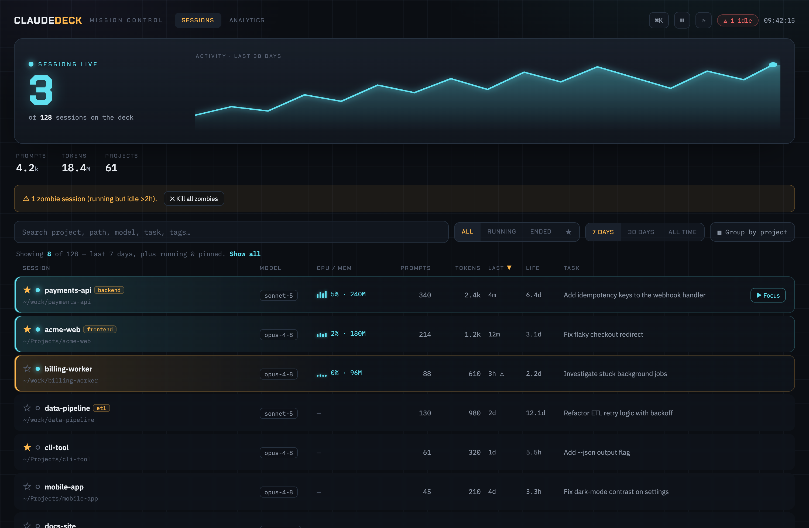

# ClaudeDeck

**Mission control for your Claude Code sessions.** A local web dashboard that tracks every Claude Code session — running or long-finished — on your Mac, with live status, resource usage, rich analytics, and one-click jump-to-terminal / resume.

> 100% local. No account, no cloud, no telemetry. It only reads files Claude Code already writes on your machine.



## Why
If you run many Claude Code sessions across many directories, there's no way to see them all, remember what each was doing, find an old one, or jump back in. ClaudeDeck is the missing control plane: one screen for every session, past and present.

## Features
- **Every session, ever** — auto-ingested from `~/.claude`; zero setup.
- **Live status** — which sessions are running *right now* (real process detection), which are idle "zombies", which ended.
- **Live CPU / memory** per running session.
- **Jump & resume** — click a running session to focus its iTerm2 tab; click a finished one to open a new tab and `claude --resume` it.
- **Analytics** — activity heatmap, top projects, model & token usage.
- **Organize** — favorites ★, tags, notes, group-by-project, and a ⌘K palette to jump to any session.
- **Zombie sweep** — flag and bulk-kill sessions that are running but idle.

## Quick start

**Install (prebuilt binary):**
```bash
curl -fsSL https://raw.githubusercontent.com/tachodril/claude-deck/main/install.sh | bash
claude-deck              # opens http://localhost:7420
```
Add `--service` to the installer to also run it always-on (see below).

**Or build from source** (needs Go 1.24+ and Node 18+):
```bash
git clone https://github.com/tachodril/claude-deck && cd claude-deck
./build.sh               # builds the React frontend + the Go binary
./claude-deck            # opens http://localhost:7420
```

## Always-on (auto-start at login, restart on crash)
```bash
./deploy/install-service.sh      # or: make service
```
Installs a macOS `launchd` agent. Remove with `./deploy/uninstall-service.sh`.

## How it works
A single Go binary embeds the React UI and serves it on `localhost`. On startup it ingests your session data into a local SQLite DB (`~/.claude/claude-deck.db`) and computes live status from running processes.

| Data | Source |
|---|---|
| prompts, last-used, first prompt | `~/.claude/history.jsonl` |
| model, tokens, git branch, messages | `~/.claude/projects/**/*.jsonl` transcripts |
| running status, CPU, memory | live `pgrep`/`lsof`/`ps` (computed per request) |
| favorites, tags, notes | ClaudeDeck's own SQLite table (survives re-ingest) |

Your favorites/tags/notes are the only original data ClaudeDeck stores; everything else is derived from Claude Code's own files.

### The Task column (optional)
Each session can show a one-line **task** summary. If a session's directory has a `.claude/context/CURRENT_TASK.md`, ClaudeDeck uses it; otherwise it falls back to the session's first prompt. To get curated task summaries (with a tiny hook or by hand), see **[docs/TASK_TRACKING.md](docs/TASK_TRACKING.md)**.

## Requirements
- **macOS** with **iTerm2** (the focus/resume actions drive iTerm2 via AppleScript; the rest of the dashboard works regardless).
- **Claude Code** installed (so `~/.claude` exists).

## Development
```bash
make dev     # frontend hot-reload (Vite), proxies /api → :7420
make build   # production build
make help    # all targets
```
Stack: Go (backend, SQLite) + React + TypeScript + Vite + Tailwind (embedded via `go:embed`).

## Contributing
Contributions are very welcome — and genuinely appreciated. 🙌 Issues, feature ideas, docs fixes, and pull requests are all fair game; you don't need permission to open one.

Especially welcome:
- **Terminal drivers** beyond iTerm2 (Terminal.app, Ghostty, WezTerm, …) and **Linux** support
- New dashboard features and **UX polish**
- **Parser robustness** across Claude Code versions

Getting started: `make dev` runs the frontend with hot-reload (see [Development](#development)); `make build` produces the binary. Keep PRs focused and describe the change — and if you're planning something big, open an issue first so we can align. First-time contributors are more than welcome.

Thanks for helping make ClaudeDeck better!

## License
MIT — see [LICENSE](LICENSE).
